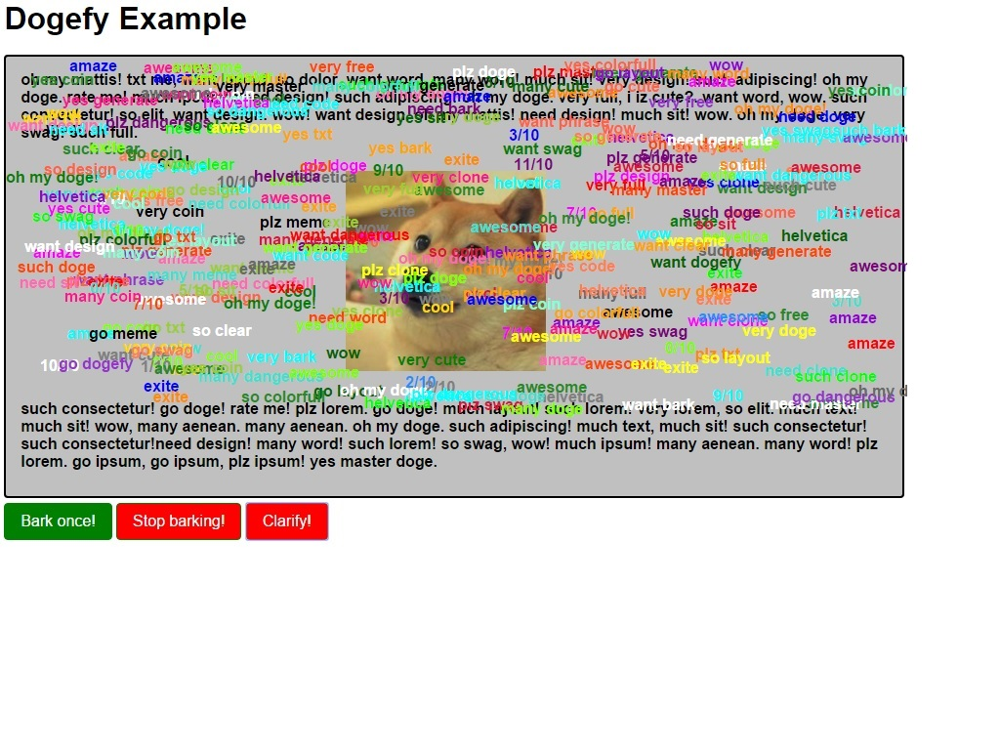

| <h1>Dogefy</h1> **v0.1 (beta)** |
:-----------------:
| A JS lib to make your DOM bark! |
|  |


## Library proposal
Dogefy assists to make any DOM element barks like the doge, putting doge phrases in screen.  
You can make it barks! wow! such dogefy!  
You can make it barks a lot too! amaze!


## Related dependencies and concerns
    - No dependecies. Writen in pure javascript.
    - Full jQuery and other frameworks compatible.
    - For usage examples, see the samples folder and pick one ( for now is a single one ;) ).


## Licensing
    - Apache License 2.0 (Included). See 'LICENSE' file.


## Usage
You can make any DOM node a doge that barks.  
To use it in your code, just add:

> ```html
>   <script type="text/javascript" src="dist/dogefy.min.js"></script>
> ```

To dogefy an element, you have two ways:

> ```javascript
> var doge = new Dogefy(document.getElementById('your_doge'));
> ```

or jQuery way:

> ```javascript
> var doge = new Dogefy($('#your_doge'));
> ```

Now you have a doge in your 'doge' var.  
This was created with the selected node.  
To make it work properly, you have to initialize it with **init()** function:

> ```javascript
> doge.init();
> ```

An initialized doge can bark!

> ```javascript
> doge.bark();
> ```

This will generate a doge phrase with a randon color in dogefy existent colors.  
That will be like:


Alternatly, you can make **a DOM Node** a doge with:

> ```javascript
> var doge = document.getElementById('your_doge').dogefy();
> ```

or:

> ```javascript
>  var doge = $('#your_doge').dogefy();
> ```

This will create **an initialized doge** with the selected element.
**Do not use init() on that! Alternate method even returns an initialized doge!**


## Options
You can set some options to personalize your doge.

#### 1. fullWords
The words the doge will say itself, like 'wow', or 'amaze'.  
You set this with **an array of strings**.  
\***Set this option will override default words.**

> ```javascript
>  var doge = $('#your_doge').dogefy({
> 		fullWords: ['wow', 'uhoh!', 'great']
> });
> ```

#### 2. firstWords
The words the doge will use to say starting a phrase, like 'so', or 'many'.  
You set this with **an array of strings**.   
\***Set this option will override default words.**

> ```javascript
>  var doge = $('#your_doge').dogefy({
> 		firstWords: ['very', 'not']
> });
> ```

#### 3. lastWords
The words the doge will use to say ending a phrase.  
This can be any common name.  
You set this with **an array of strings**.  
\***Set this option will override default words.**

> ```javascript
>  var doge = $('#your_doge').dogefy({
> 		lastWords: ['doge', 'computing', 'player', 'car']
> });
> ```

#### 4. colors, fonts and sizes
The colors, fonts and sizes of the doge phrases to show.  
One of then will be chosen randomly each time it barks.  
Is setted with a list of possible values.  
For the color, that can be **the name of the color** (HTML color name), or **the HEX value itself** (HTML style).  
For the sizes, that have to be **the size in pixels**.  
For the fonts, that can be **the name of the font** (HTML style).  
\***Set these options will override default values.**

> ```javascript
>  var doge = $('#your_doge').dogefy({
> 		colors: ['red', 'green', 'blue', '#000', '#ffcc66'],
> 		fonts: ['Arial', 'Helvetica', 'Times New Roman'],
> 		sizes: ['16', '20', '24', '32']
> });
> ```

#### 5. barkInterval
Is used to delay barks when doge barks a lot (\*vide **manyBark()**).  
This is the time **in millis** to delay many barks.  
The default value is **0** (no interval).  
\***You can only set up the doge to barks a lot if you set this value to at least 1.**

> ```javascript
>  var doge = $('#your_doge').dogefy({
> 		barkInterval: 500
> });
> ```

#### 6. barkDelay
Is used to delay single barks.  
This is the time **in millis** to delay barks.  
The default value is **0** (no delay).

> ```javascript
>  var doge = $('#your_doge').dogefy({
> 		barkDelay: 50
> });
> ```

#### 7. barkDuration
The duration of the bark.  
This is the time **in millis** to hide barks.  
After this amount of time, the bark will hide.  
The default value is **10000** (10 seconds).  
You can change this time or make they do not hide.  
To prevent the barks to hides itself, set this to **-1**, like:

> ```javascript
>  var doge = $('#your_doge').dogefy({
> 		barkDelay: -1
> });
> ```

#### 8. barkOn, manyBarkOn and clearOn
The postfix **'on'** in these options mean a link with javascript events.  
You can set this like:

> ```javascript
>  var doge = $('#your_doge').dogefy({
> 		barkOn: 'click'
> });
> ```

or with a list of events:

> ```javascript
>  var doge = $('#your_doge').dogefy({
> 		clearOn: ['mouseout', 'mouseover']
> });
> ```

These means the chosen event(s) will be bounded with the dogefied element.  
The main difference between then is **the action after the event fires** (clear, bark or manyBark).

#### 9. barkFrom, manyBarkFrom and clearFrom
The postfix **'from'** in these options mean a link to another element.  
You can set this like:

> ```javascript
>  var doge = $('#your_doge').dogefy({
> 		clearFrom: document.getElementById('btn')
> });
> ```

These means the chosen element will be bounded with the selected doge event (clear, bark or manyBark) **by click**.  
When you click in the element you pass in option, your doge will react with the action you choose.  
You can pass **only one** element on these options.

#### 10. barkWhen, manyBarkWhen and clearWhen
The postfix **'when'** in these options mean you can pass a function as value.  
You can set this like:

> ```javascript
>  var doge = $('#your_doge').dogefy({
> 		manyBarkWhen: function(callBack) {
> 			$('#btn').addEventListener('click', function(e) {
> 				callBack();
> 			}
> 		});
>  }
> });
> ```

You can pass the function you want. The only concern is that function have to receive (and use) a callback.  
**The callback must be the only parameter of the function!**
The callback will be the selected doge event (clear, bark or manyBark).  
With this you can set straight conditions for each doge event.


## Methods

#### 1. init()
The first method to be called when creating a doge (\*unless you use the **alternate way**).  
This sets up a doge, to be totally usefull.  
Returns a your doge, fully usefull.  
**Do not use this on an initialized doge!**  
Usage:

> ```javascript
> doge.init();
> ```

This method return the doge, initialized.  
All other methods works **on initialized doges**.

#### 2. bark()
Is the voice of the doge.  
Render a doge phrase into the dogefied element, randomly positioned.

> ```javascript
> doge.bark();
> ```

#### 3. manyBark()
Is what doge do when exited or in rage.  
Render many doge phrases into the dogefied element, randomly positioned.
\***You can only use this method if you set the value for 'barkInterval' to at least 1.**

> ```javascript
> doge.manyBark();
> ```

#### 4. set(prop, val)
Used to set properties. Can be used to any doge option.  
**This method overrides the selected option values with the new values.**  
Usage:

> ```javascript
> doge.set('barkOn', ['keydown', 'click']);
> ```

This method return the doge, updated.

#### 5. put(prop, val)
Used to append values to properties. Can be used **only on list options**.  
This method **don't overrides the selected option values**. Only append more values to it.  
Usage:

> ```javascript
> doge.put('colors', '#ffffff');
> ```

or:

> ```javascript
> doge.put('colors', ['#ff0000', 'yellowgreen', 'deeppink']);
> ```

This method return the doge, updated.

#### 6. clearBarks()
Removes many barks from dogefied element. **Not all of then!**

> ```javascript
> doge.clearBarks();
> ```

#### 7. defaults()
Reset the doge options to default values. Make it showns as a new doge.

> ```javascript
> doge.defaults();
> ```

This method return the doge, resetted.


## Examples
Dogefy was built to be personalized.  
You can just make adjusts in default options, or make your very own doge.  
Using provided methods, you can change the way your doge act in runtime!

##### A common doge
A simple use of dogefy sets one button or other element to make it bark, for example.  
The defaults of dogefy already have many words and colors for barks.  
A very simple doge is like this:

> ```javascript
>  var doge = document.getElementById('doge').dogefy({
> 	 	barkFrom: document.getElementById('btn'),
> 		clearFrom: document.getElementById('btn3')
>  });
>```

This will create a doge with manners to bark and clear barks.  
The barks will hide in 10 seconds as default.

##### A **very** personalized doge
Another use of dogefy sets many, many things.  
You  can personalize almost everything in a doge.  
Like this:

> ```javascript
>  var doge = document.getElementById('doge').dogefy({
> 		barkOn: ['click', 'mouseover'],
> 		barkDelay: 50,
> 		barkInterval: 500,
> 		barkDuration: -1,
> 		barkFrom: document.getElementById('btn'),
> 		clearWhen: function(callBack) {
> 			var btn = document.getElementById('btn3');
> 			btn.addEventListener('click', function() {
> 				callBack();
> 			});
> 		},
> 		manyBarkWhen: function(callBack) {
> 			var alot = document.getElementById('btn2');
> 			alot.addEventListener('click', function() {
> 				if (alot.innerHTML === 'Bark a lot!') {
> 					alot.innerHTML = 'Stop barking!';
> 					alot.style.backgroundColor = 'red';
> 				} else {
> 					alot.innerHTML = 'Bark a lot!';
> 					alot.style.backgroundColor = 'green';
> 				}
> 				callBack();
> 			});
> 		},
> 		fullWords: ['none', 'nope'],
> 		firstWords: ['very', 'not', 'go'],
> 		lastWords: ['common', 'dogefy', 'bark'],
> 		colors: ['red', 'yellow', 'blue', 'green', 'black', '#ffcc00'],
> 		clearOn: ['load', 'mouseout']
>  });
>```

This will create a doge with many boundaries and speaking very different words, with different colors and things.

##### Runtime things
If you don't set all things, you can set it after, like:

> ```javascript
> doge.put('colors', '#ffffff')
> 		.set('fullWords', ['oh my doge'])
> 				.set('barkDelay', 100);
> ```

or reset the doge:

> ```javascript
> doge.defaults();
> ```
